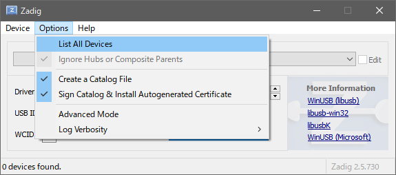
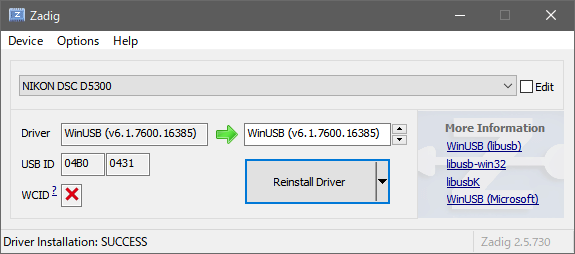
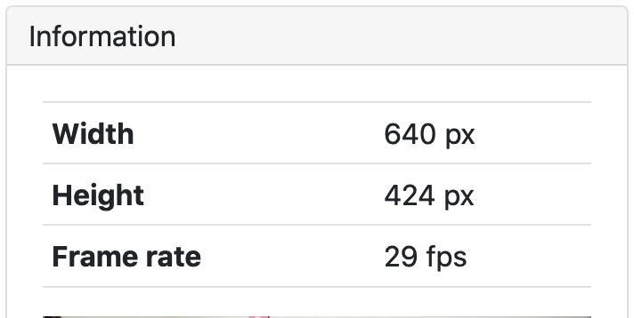
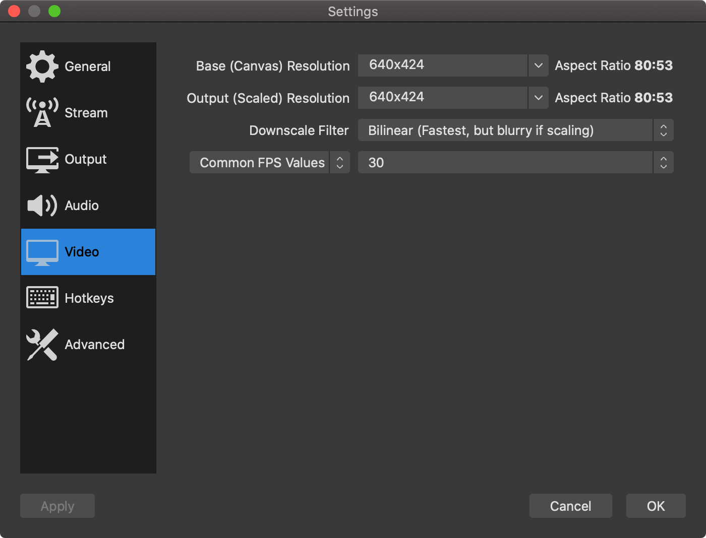
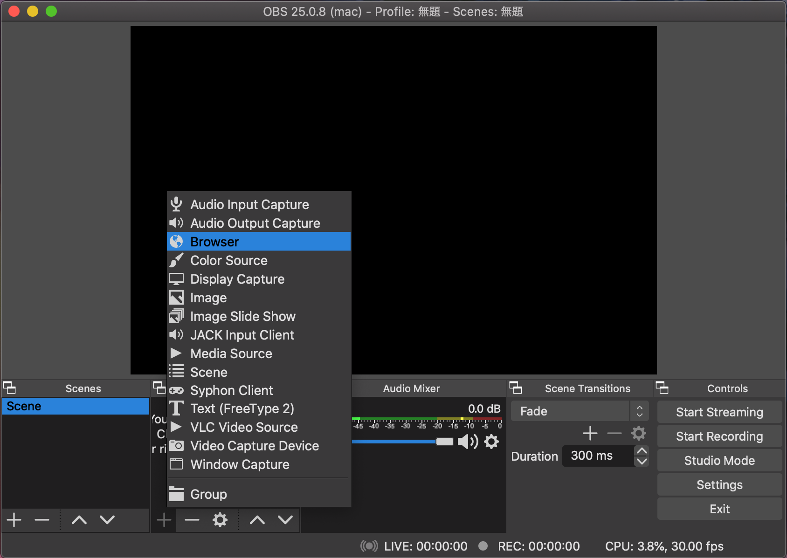
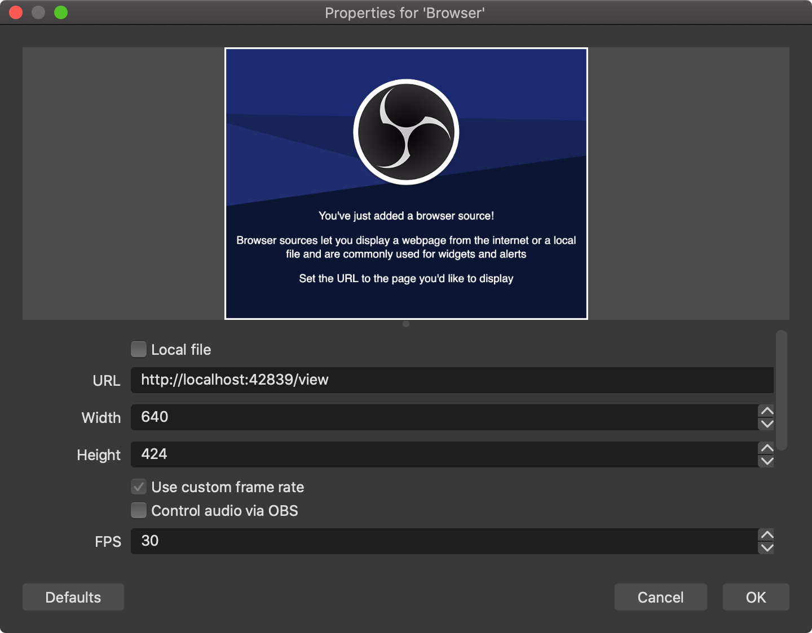

## Introduction


mtplvcap is a multi-platform (Windows/Mac/Linux) relay that broadcasts Live View stream of Nikon DSLRs. 

Combination of mtplvcap and OBS will turn your DSLRs into web cameras. Enjoy video chatting on Google Hangouts/Meet/Zoom etc. with your favorite cameras!

Proceed to "How to install" and "Usage" to get started.


## Verified environments

Cameras:
 - Nikon D5300

OSes:
 - Windows 10 version 1909, OS build 18363.900, MSYS2 (MinGW x86_64), amd64
 - macOS 10.15.5 Catalina, amd64
 - Debian GNU/Linux 10 Buster, amd64


## How to install

The snippets described here should run as-is and copy-and-pastable.


### Windows

Note: **[Pre-built binary](https://github.com/puhitaku/mtplvcap/releases) is available! Follow the steps only in `Replace Nikon DSLR driver` and skip `Build in MSYS2` if you use this.**

**Caution! It is required to replace the pre-installed MTP driver with libusb driver. Your Nikon DSLR will not be recognized as an MTP device and will not behave like before. I'm not responsible of any troubles regarding drivers.**


#### Replace Nikon DSLR driver

1. Connect your Nikon DSLR to the PC
1. Download Zadig from [here](https://zadig.akeo.ie/) and launch it
1. Tick `List All Devices`

     

1. Make sure that your camera is in the list upper in the window and choose it

    

    (This screenshot was taken after the libusb driver is installed and will differ from what you see)

1. Choose `libusb-win32 (vX.X.X.X)` in the input box at middle of the window
    - Please keep in mind that `WinUSB` does NOT work. Be careful not to choose it.

1. Click `Replace Driver` button and wait it finishes the installation
    - Optionally, open the Device Manager and make sure it's installed

    


#### Build mtplvcap in MSYS2

1. Download and install MSYS2 from [here](https://www.msys2.org/)
1. Launch "MSYS2 MSYS" in the Start Menu
1. Install prerequisites

    ```sh
    pacman -Sy mingw-w64-x86_64-toolchain \
               mingw-w64-x86_64-libusb \
               mingw-w64-x86_64-go \
               mingw-x64-x86_64-pkg-config \
               git
    ```

1. Add PATHs

    ```sh
    echo 'PATH=$PATH:/mingw64/bin:/mingw64/lib/go/bin' >> ~/.bashrc
    source ~/.bashrc
    ```

1. Clone this repo

    ```sh
    git clone https://github.com/puhitaku/mtplvcap.git
    ```

1. `cd`, build, and launch it
    - Make sure your camera opens up its shutter

    ```sh
    cd mtplvcap
    CGO_CFLAGS='-Wno-deprecated-declarations' go build .
    ./mtplvcap.exe -debug server
    ```

1. Done!
    - The binary can be moved and redistributed easily
    - Copy `libusb-1.0.dll` from `C:\msys64\mingw64\bin\libusb-1.0.dll` and place the copy alongside `mtplvcap.exe` to launch it directly from Explorer


#### macOS

Note: I have no redistributed pre-built binaries like Homebrew Formulae at present.

1. Install XCode Command Line Tools with `xcode-select --install`

1. [Install Homebrew](https://brew.sh/) 

1. Install prerequisites

    ```sh
    brew install golang libusb git
    ```

1. Clone this repo

    ```sh
    git clone https://github.com/puhitaku/mtplvcap.git
    ```

1. `cd`, build, and launch it
    - Make sure your camera opens up its shutter

    ```sh
    cd mtplvcap
    CGO_CFLAGS='-Wno-deprecated-declarations' go build .
    ./mtplvcap -debug server
    ```

1. Done!


#### Linux (e.g. Ubuntu/Debian)

1. Install prerequisites
    ```sh
    sudo apt install golang-go libusb-1.0.0-dev
    ```

1. `cd`, build, and launch it
    - Make sure your camera opens up its shutter

    ```sh
    cd mtplvcap
    CGO_CFLAGS='-Wno-deprecated-declarations' go build .
    ./mtplvcap -debug server
    ```


### Usage

```sh
 mtplvcap $ ./mtplvcap -help
Usage of ./mtplvcap:
  -backend-go
        force gousb as libusb wrapper (not recommended)
  -debug string
        comma-separated list of debugging options: usb, data, mtp, server
  -host string
        hostname: default = localhost, specify 0.0.0.0 for public access (default "localhost")
  -port int
        port: default = 42839 (default 42839)
  -product-id string
        PID of the camera to search (in hex), default=0x0 (all) (default "0x0")
  -server-only
        serve frontend without opening a DSLR (for devevelopment)
  -vendor-id string
        VID of the camera to search (in hex), default=0x0 (all) (default "0x0")
```

#### Watch incoming frames

 - Open `localhost:42839/view` with your favorite browser and then captured frames will be displayed
 - Specify `-host {address}` to tell mtplvcap where to listen, e.g. `-host 0.0.0.0` allows public access
 - And also specify `-port {port}` to change the port number


#### Control your DSLR on your browser

 - Open `localhost:42839` with your favorite browser
 - "Auto Focus" section provides periodic/manual AF control
 - "Rate Limit" section can limit the capture rate to decrease overall CPU usage
 - "Information" section shows the dimension of LV images etc.


#### Connect with Zoom, Google Meet, Google Hangouts, etc.

1. Install mtplvcap and check if it works
1. Install OBS (Open Broadcaster Software) from [here](https://obsproject.com/)
1. Open OBS preference and "Video" tab
1. Adjust resolutions to fit with LV frame dimension
    - Launch mtplvcap and open `localhost:42839` to know the actual resolution
    
    
1. Add a "Browser" source
    
1. Set `http://localhost:42839/view` as the URL
    
1. BOOM!
    


### Caveats / Known Issues

 - This software is in alpha stage.
 - All: shutter goes down and up suddenly.
    - Currently I have no clue to solve it. Please be patient.
    - As a work-around, mtplvcap watches the shutter and opens it if necessary.
 - Windows: on MinTTY, the process gets killed without graceful shutdown when you press Ctrl-C.
    - It will result a fail of next launch and might require you to re-plug the camera in.
    - It's a known behavior and is not a bug of mtplvcap.
    - Please install winpty with pacman and run via it `winpty ./mtplvcap`
    - Running mtplvcap directly from Explorer with double-click runs without this problem


### FEEDBACK

 - Posting issues and PRs is welcome. Follow [CONTRIBUTING.md](./CONTRIBUTING.md) for contribution.
 - I verified only with Nikon D5300. No other cameras are verified. Please tell me if mtplvcap works (or not) with your camera.


### CREDIT

This program is based on [github.com/hanwen/go-mtpfs](https://github.com/hanwen/go-mtpfs).
Special thanks to Han-Wen-san for its robust and mature MTP implementation.


### LICENSE

[LICENSE file](./LICENSE)
